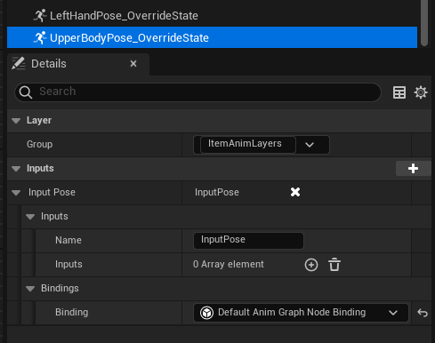
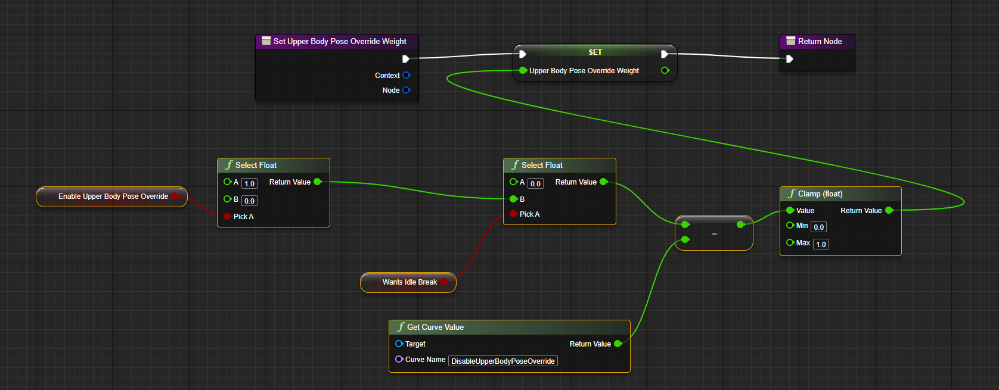
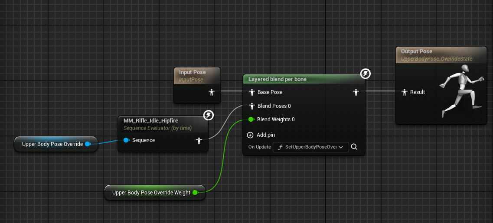
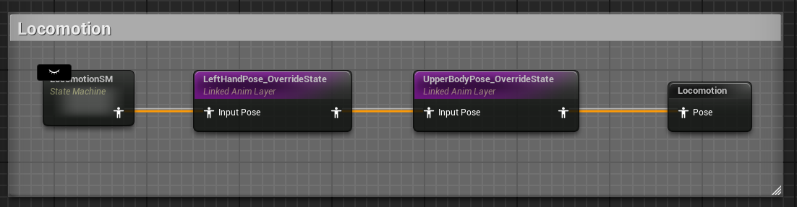
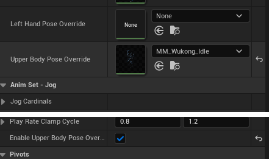

# Lyra First Person Shooter
This is my attempt at implementing first person character based on Lyra. This repo is a game feature plugin that only depends on the base Lyra classes and assets (no dependencies on ShooterCore). [Here](https://youtu.be/F8nx2BPH0cs) is a quick demo.

This setup is inspired by [philspaz](https://github.com/philspaz/AfootLyraExtension) and [Octahedron](https://www.youtube.com/playlist?list=PLxYB4IVFm8q6tf3boC1Nm4A8AB2RMCpXn)

## Prerequisites
- Unreal Engine 5.4
- AGR PRO Plugin
- Unmodified Lyra Project

## Base Class Changes
I tried my best to make minimal changes to the base Lyra classes, but changes here and there are inevitable and some classes are more trouble than its worth to extend.

### ALyraCharacter -> LyraGame/Character/LyraCharacter.h
- export LYRAGAME_API for ALyraCharacter
- Turn CameraComponent into a protected variable
- Turn ToggleCrouch into a virtual method

### ULyraCameraComponent -> LyraGame/Camera/LyraCameraComponent.h
- export LYRAGAME_API for ULyraCameraComponent

### UPhysicalMaterialWithTags -> LyraGame/Physics/PhysicalMaterialWithTags.h
- export LYRAGAME_API for UPhysicalMaterialWithTags

### ULyraGameplayAbility_FromEquipment -> LyraGame/Equipment/LyraGameplayAbility_FromEquipment.h
- export LYRAGAME_API for ULyraGameplayAbility_FromEquipment

### FLyraGameplayAbilityTargetData_SingleTargetHit -> LyraGame/AbilitySystem/LyraGameplayAbilityTargetData_SingleTargetHit.h
- export LYRAGAME_API for FLyraGameplayAbilityTargetData_SingleTargetHit

### ULyraReticleWidgetBase -> LyraGame/Equipment/LyraGameplayAbility_FromEquipment.h
- export LYRAGAME_API for ULyraReticleWidgetBase

### FLyraAnimLayerSelectionSet -> LyraGame/Cosmetics/LyraCosmeticAnimationTypes.h
- export LYRAGAME_API for FLyraAnimLayerSelectionSet

### ULyraDevelopmentStatics -> LyraGame/System/LyraDevelopmentStatics.h
- export LYRAGAME_API for ULyraDevelopmentStatics 

### ULyraRangedWeaponInstance -> LyraGame/Weapons/LyraRangedWeaponInstance.h
- export LYRAGAME_API for ULyraRangedWeaponInstance

### ULyraEquipmentDefinition -> LyraGaame/Equipment/LyraEquipmentDefinition.h
- export LYRAGAME_API for ULyraEquipmentDefinition

### ULyraWeaponInstance -> LyraGame/Weapons/LyraWeaponInstance.h
- export LYRAGAME_API for ULyraWeaponInstance 

### ILyraAbilitySourceInterface -> LyraGame/AbilitySystem/LyraAbilitySourceInterface.h
- export ILyraAbilitySourceInterface

### ULyraEquipmentInstance -> LyraGame/Equipment/LyraEquipmentInstance.h
- export LYRAGAME_API for ULyraEquipmentInstance 
- Turn SpawnedActors into a protected variable

### ULyraEquipmentManagerComponent -> LyraGame/Equipment/LyraEquipmentManagerComponent.h
- export LYRAGAME_API for FLyraAppliedEquipmentEntry
- make changes to FLyraAppliedEquipmentEntry:
	- add these public functions:
        ```cpp
        TSubclassOf<ULyraEquipmentDefinition> GetEquipmentDefinition() const { return EquipmentDefinition; }
        void SetEquipmentDefinition(TSubclassOf<ULyraEquipmentDefinition> InEquipmentDef) { EquipmentDefinition = InEquipmentDef; }

        TObjectPtr<ULyraEquipmentInstance> GetEquipmentInstance() const { return Instance; }
        void SetEquipmentInstance(TObjectPtr<ULyraEquipmentInstance> InInstance) { Instance = InInstance; }
        
        FLyraAbilitySet_GrantedHandles GetGrantedHandles() const { return GrantedHandles; }
        ```
- export LYRAGAME_API for ULyraEquipmentManagerComponent
- make EquipItem, UnequipItem, GetFirstInstanceOfType and GetEquipmentInstancesOfType into virtual methods

### ULyraInventoryItemInstance -> LyraGame/Inventory/LyraInventoryItemInstance.h
- export LYRAGAME_API for ULyraInventoryItemInstance 

### UInventoryFragment_EquippableItem -> LyraGame/Inventory/InventoryFragment_EquippableItem.h
- export LYRAGAME_API for UInventoryFragment_EquippableItem 

### ULyraAbilitySet -> LyraGame/AbilitySystem/LyraAbilitySet.h
- export LYRAGAME_API for ULyraAbilitySet
- export LYRAGAME_API for FLyraAbilitySet_GrantedHandles

### ULyraWeaponUserInterface -> LyraGame/UI/Weapons/LyraWeaponUserInterface.h
- export LYRAGAME_API for ULyraWeaponUserInterface
- turn RebuildWidgetFromWeapon() into a protected method
- turn CurrentInstance into a protected variable

### ULyraWeaponStateComponent -> LyraGame/Weapons/LyraWeaponStateComponent.h
- export LYRAGAME_API for ULyraWeaponStateComponent

### ULyraAnimInstance -> LyraGame/Animation/LyraAnimInstance.h
- export LYRAGAME_API for ULyraAnimInstance

### ULyraHeroComponent -> LyraGame/Character/LyraHeroComponent.h
- export LYRAGAME_API for ULyraHeroComponent
- turn Input_LookMouse and Input_LookStick into virtual functions

### ULyraQuickBarComponent -> LyraGame/Equipment/LyraQuickBarComponent.h
- export LYRAGAME_API for ULyraQuickBarComponent
- add a public GetEquippedItem() function that returns EquippedItem:
```cpp
UFUNCTION(BlueprintCallable, BlueprintPure = false)
ULyraEquipmentInstance* GetEquippedItem() const;
// ...
ULyraEquipmentInstance* ULyraQuickBarComponent::GetEquippedItem() const
{
        return EquippedItem ? EquippedItem : nullptr;
}
```

### Lyra Animation Blueprints
#### ALI_ItemAnimLayers -> Content/Characters/Heroes/Mannequin/Animations/LinkedLayers
- duplicate LeftHandPose_OverrideState and name it UpperBodyPose_OverrideState



#### ABP_ItemAnimLayersBase -> Content/Characters/Heroes/Mannequin/Animations/LinkedLayers

- duplicate SetLeftHandPoseOverrideWeight and name it SetUpperBodyPoseOverrideWeight. Then turn it like [this](https://blueprintue.com/blueprint/860h9j-9/) blueprint (create new variables where appropriate)



- implement the newly added UpperBodyPose_OverrideState animation layer with the exact same implementation as LeftHandPose_OverrideState, but with some modifications:
  - duplicate the LeftHandePoseOverride variable and name it UpperBodyPoseOverride. This will be the pose that we use to override the whole upper body split
  - change the blend weight to use UppoerBodyPoseOverrideWeight we just created
  - set the OnUpdate function of the blend per bone node to use SetUpperBodyPoseOverrideWeight. Also set the Blend Masks to UpperBodyMask



#### ABP_Mannequin_Base -> Content/Characters/Heroes/Mannequin/Animations

- add the new linked animation layer graph right after the LeftHandPose_OverrideState



#### ABP_WukongAnimLayers -> Plugins/FPSCore Content/Characters/Heroes/Mannequin/Animations/Locomotion/Wukong
- set the upper body pose override to MM_Wukong_Idle and set EnableUpperBodyPoseOverride to true



If you want to add more weapons, instead of creating new set of locomotions animation (and configuring the different animation notifies and graphs for each individual sequence) you can just create a single upper body pose while still using Lyra's locomotion for everything else.


## Installation
Make sure that you have made the changes above to your Lyra classes and then just clone this repo to ```<your-project>/Plugins/GameFeatures```.
